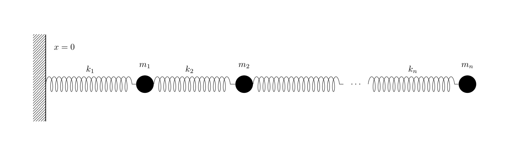

```toml
[fuzz]
exec = ["cargo", "run", "--release", "--", "generate"]
env = {}

[judge]
exec = ["cargo", "run", "--release", "--", "validate"]

[problem]
points = 16
difficulty = 2
```

# 📏 Coupled Oscillator
Given the initial positions and velocities of several objects, their masses and the spring constants the springs between them, find the **position of $m_1$ after 5 seconds** (there is a small tolerance for answers of ±0.01). **Each spring is at rest at a length of 5**. The spring associated with each mass is connected to the previous one with the spring on $m_1$ being fixed to the wall at $x = 0$. Assume friction is negligible and the springs are connected to the centre of each mass.



## Required Formulae 
* $x(t) = \int v(t) \cdot \text d t = \iint a(t) \cdot \text d t$
* $a = \frac{F}{m}$
* $F = -kx$ where $x$ is the spring's displacement from it's resting position.


## Input
The input is the initial positions, initial velocities, masses and spring constants of the associated spring of each mass in a comma separated list on each line. Note that the first line is the column headings (you should be able to load this as a CSV if you would like).
```
x, v, m, k
4.519682246056055, 0.006057547287009886, 0.4720210186778375, 0.7217394413959926
10.642132817104763, 0.0031224679024967426, 0.21657133905799653, 0.5461967114662716
14.487810046686276, -0.003975385684572745, 0.1687279268213147, 0.11853726080301433
20.407795215731717, -0.00815926647554794, 0.2548457175604282, 0.2341962203375051
25.95426456046505, 0.006167531349303609, 0.4559868024534758, 0.2612599218634285
29.03544765580003, 0.0074467750760784015, 0.48754313967588103, 0.5154992332862417
```

## Output
Your output should be the final position of $m_1$.
