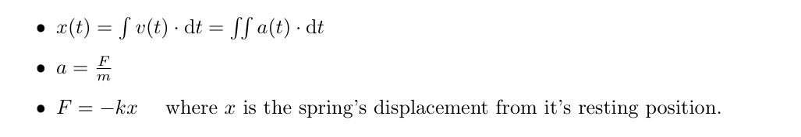

```toml
[fuzz]
exec = ["cargo", "run", "--release", "--", "generate"]
env = {}

[judge]
exec = ["cargo", "run", "--release", "--quiet", "--", "validate"]

[problem]
points = 21
difficulty = 3
```

# 📏 Coupled Oscillator
Given the initial positions and velocities of several objects, their masses and the [spring constants](https://en.wikipedia.com/wiki/hooke%27s_law) of springs between them, find the **position of m<sub>1</sub> after 5 seconds** (there is a small tolerance for answers of ±0.05). **Each spring is at rest at a length of 5**. The spring associated with each mass is connected to the previous one with the spring on m<sub>1</sub> being fixed to the wall at x = 0. Assume friction is negligible and the springs are connected to the centre of each mass.


## Required Formulae 


To clarify:
* A spring with spring constant k<sub>1</sub> connects m<sub>1</sub> to the wall at x = 0. This means that the force on m<sub>1</sub> at any time is -k<sub>1</sub> times the position of m<sub>1</sub> (the position of one end of the spring) minus 0 (the position of the other end of the spring) minus 5 (the length at which the spring is at rest.
* The force is the same at either end of a spring. This means that both m<sub>1</sub> and m<sub>2</sub> (which are both connected by a spring with spring constant k<sub>2</sub>) will both experience a force of magnitude k<sub>2</sub> times the difference between 5 (the resting length of the spring) and the distance between m<sub>1</sub> and m<sub>2</sub> (the length of the spring at that instant) but in opposite directions.


## Input
The input is the initial positions, initial velocities, masses and spring constants of the associated spring of each mass in a comma-separated list on each line. Note that the first line is the column headings (you should be able to load this as a CSV if you would like).
```
x, v, m, k
4.519682246056055, 0.006057547287009886, 0.4720210186778375, 0.7217394413959926
10.642132817104763, 0.0031224679024967426, 0.21657133905799653, 0.5461967114662716
14.487810046686276, -0.003975385684572745, 0.1687279268213147, 0.11853726080301433
20.407795215731717, -0.00815926647554794, 0.2548457175604282, 0.2341962203375051
25.95426456046505, 0.006167531349303609, 0.4559868024534758, 0.2612599218634285
29.03544765580003, 0.0074467750760784015, 0.48754313967588103, 0.5154992332862417
```

## Output
Your output should be the final position of m<sub>1</sub>.
