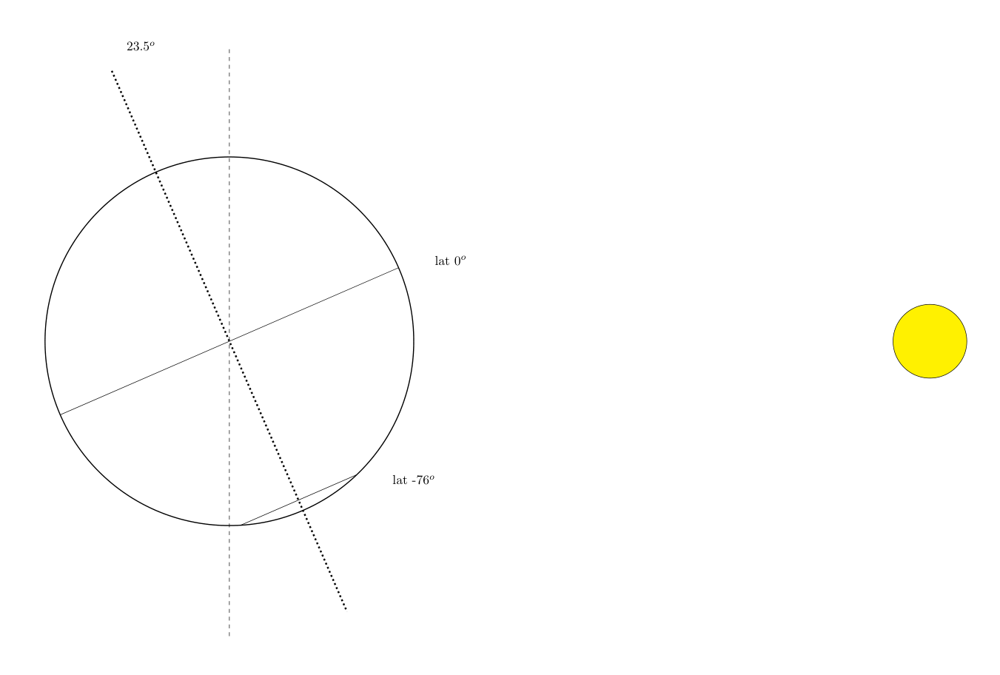

```toml
# TODO: Verify that generated answers are actually correct. 
# TODO: Clarify tilt relative to sun

[fuzz]
exec = ["cargo", "run", "--release", "--", "generate"]
env = {}

[judge]
exec = ["cargo", "run", "--release", "--", "validate"]

[problem]
points = 20
difficulty = 3
```

# 🇦🇶Solar powered research station
A remote Antarctic research station is being designed and solar cells are being considered as a method of powering the station. The station is set to be located at a **latitude of -76** (76° lower than the equator). The Earth's equator is on a **23.5° axial tilt** from it's orbital plane. Assume that the orbital inclination is 0°. A solar panel can be **rotated north and south by ±15° from pointing straight up** with motors but doing so costs **1 joule per degree** of rotation. The panel outputs $\alpha\cos(\theta)$ watts (joules per second) where $\theta$ is the angle between the panel and the sun and $\alpha$ is your question input. Find the maximum possible number of joules that can be generated in 1 day.



## Input
Your input is the $\alpha$ parameter of the solar cell.

## Output
Your output should be amount of energy generated in 1 day in joules.
